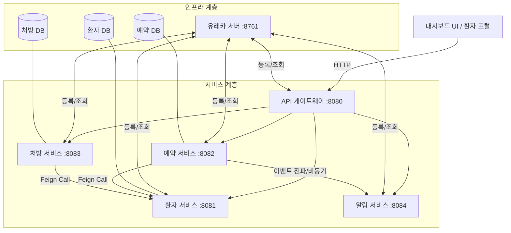

# 프로젝트 아키텍처 개요 (Architecture Overview)

이 프로젝트는 의료 관리 플랫폼을 위한 마이크로서비스 아키텍처(MSA)입니다. Spring Cloud를 사용하여 서비스 발견, 라우팅 및 회복성을 관리합니다.

## 시스템 구조도

## 핵심 구성 요소

1.  **대시보드 (Frontend)**: Nginx로 서빙되는 정적 HTML/JS입니다. API 게이트웨이를 통해 백엔드와 통신합니다.
2.  **API 게이트웨이 (API Gateway)**: 모든 요청의 진입점입니다. 라우팅 및 (선택적으로) JWT 인증을 처리합니다.
3.  **유레카 서버 (Eureka Server)**: 서비스 레지스트리입니다. 서비스들이 서로의 IP 주소를 하드코딩하지 않고도 찾을 수 있게 해줍니다.
4.  **환자 서비스 (Patient Service)**: 환자 기록(CRUD)을 관리합니다.
5.  **예약 서비스 (Appointment Service)**: 진료 예약을 관리하며, 환자 서비스(Feign)를 통해 환자 유효성을 확인합니다.
6.  **처방 서비스 (Prescription Service)**: 약 처방 발행을 담당합니다. 서킷 브레이커를 사용하여 환자 데이터 확인 시 장애 전파를 방지합니다.
7.  **알림 서비스 (Notification Service)**: 예약 확정 등의 이벤트 발생 시 알림을 전송합니다.

## 데이터 흐름 (처방전 연동 수정 사항)

-   **프론트엔드**: `GET /prescription-service/prescriptions?patientId=1` 요청을 보냅니다.
-   **게이트웨이**: 해당 요청을 실행 중인 `prescription-service` 인스턴스로 전달합니다.
-   **처방 서비스**:
    *   리포지토리가 `patientId`로 필터링된 기록을 가져옵니다.
    *   프론트엔드로 목록을 반환하여 화면에 표시합니다.
