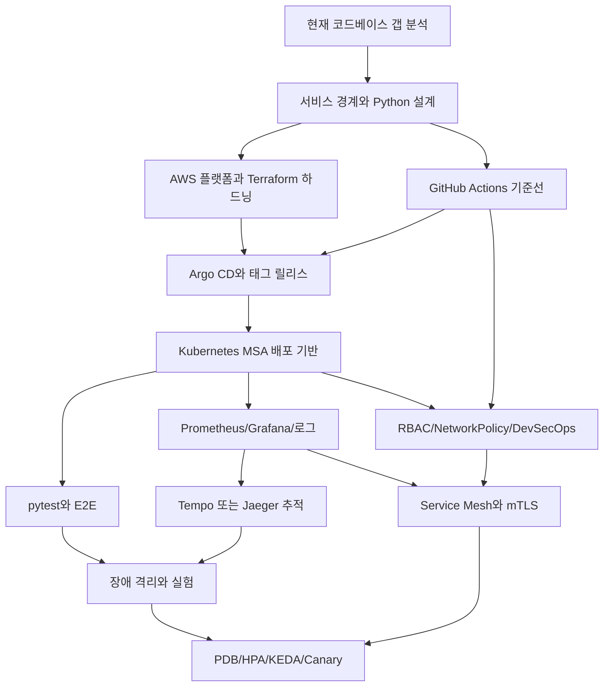

# PRD Workplan Overview

이 문서는 `project_docs/PRD.md`를 Linear 이슈로 옮기기 전에 전체 일정, 갭, 핵심 의존성을 빠르게 보기 위한 요약입니다. 실제 Linear 업로드 원본은 `project_docs/linear/workplans/*.yaml`입니다.

## 현재 갭 분석

| 영역 | 이미 된 것 | 미흡한 것 / 새로 해야 할 것 | Workplan |
| --- | --- | --- | --- |
| 기본 MSA | FastAPI 기반 auth/patient/appointment/prescription/notification, 서비스별 DB, Kafka 이벤트, Kong 라우팅/JWT/rate limit, NetworkPolicy 초안 | 서비스 설계 기준선, API/이벤트/fallback 계약, Object Storage/정적 호스팅, DB 백업/복구 정책 증거 | `00-foundation.yaml`, `20-basic-msa-platform.yaml` |
| GitHub/GitOps | `ci.yml`, `e2e.yml`, Argo CD Application 초안, AWS overlay 초안 | PR 필수 체크, release workflow, ECR image digest 추적, Argo CD source path와 overlay 정합성, GitOps 우선 롤백 runbook | `15-github-gitops-release.yaml` |
| AWS 플랫폼 | EC2/kubeadm, ECR, NLB를 만들 수 있는 Terraform 초안 | default VPC 의존 재검토, private subnet, VPC Endpoint, OIDC/profile 기반 실행, remote state/secret 기준, RDS/S3 운영 기준 | `10-cloud-platform.yaml` |
| K8sOps | namespace, Deployment/Service/Ingress, HPA 초안, local/aws overlay, 로컬 배포 스크립트 | PDB, 공통 배포/상태 확인/롤백 절차, HPA와 resource requests/limits 기준, 운영 증거 표준화 | `20-basic-msa-platform.yaml`, `50-scale-mesh.yaml` |
| 테스트 | 서비스별 pytest, Docker 기반 CI, Postman/Newman E2E 구조 | 서비스별 CI matrix/path filter, coverage 품질 게이트, E2E artifact와 독립 배포 검증 연결 | `15-github-gitops-release.yaml`, `30-test-observability.yaml`, `60-security-devsecops.yaml` |
| 관측성 | 로컬 Prometheus/Grafana/Loki/Tempo 스택, Grafana dashboard-as-code, Kong prometheus plugin | Python service metric contract, ServiceMonitor 기준, alert rule/Slack, trace id 전파와 Tempo/Jaeger 조회 증거 | `30-test-observability.yaml` |
| 복원력/실험 | prescription fallback/circuit breaker 단위 테스트, topology별 로컬 클러스터 문서 | 장애 주입 실험, topology별 부하 테스트, Kafka lag alert, MTTR/MTTD 같은 수치 증거 | `40-resilience-experiments.yaml` |
| Service Mesh | 아직 적용 전 | Istio/Linkerd 선택, Gateway/Mesh 책임 경계, traffic policy, mTLS 적용 범위와 NetworkPolicy 경계 | `50-scale-mesh.yaml` |
| DevSecOps | 기본 CI와 일부 보안 매니페스트 | SonarQube, Trivy config/image scan, SBOM, Slack security report, OPA Gatekeeper, ZAP, Falco/IR | `60-security-devsecops.yaml` |

## 일정 흐름

| 이정표 | 목표 | 핵심 작업 |
| --- | --- | --- |
| 1차 - 요구사항 분해와 기반 설계 | PRD와 현재 코드의 차이를 확인하고 설계 기준을 고정 | 갭 분석, 서비스 경계, 통신/데이터 원칙, Python 서비스 설계, 실험 지표 |
| 2차 - 클라우드 플랫폼 기반 구성 | AWS 위에 클러스터와 릴리스를 올릴 기반 마련 | 목표 아키텍처, VPC/IAM/OIDC, Terraform 하드닝, Kubernetes, ECR, NLB/DNS/TLS, RDS/S3 |
| 3차 - GitHub와 GitOps 릴리스 기반 정리 | 다음 주 분업의 공통 배포/롤백 흐름 마련 | workflow inventory, CI 기준선, Argo CD path 정합성, tag 기반 release, rollback runbook |
| 4차 - 기본 MSA 플랫폼 구성 | Kubernetes 위에 기본 MSA 실행 기반 검증 | 클러스터 검증, Service DNS, DB 분리, Gateway/JWT, Kafka, Object Storage, K8sOps runbook |
| 5차 - 테스트와 관측성 확보 | 테스트와 운영 확인 체계 마련 | pytest/CI, Postman/Newman, service metrics, Prometheus/Grafana, logs/alerts, Tempo/Jaeger tracing |
| 6차 - 장애 대응과 실험 측정 | 운영 상황을 가정한 수치 증거 확보 | 장애 격리, fallback, rate limit, topology 부하 테스트, 장애 주입, Kafka lag |
| 7차 - 확장성과 서비스 메시 고도화 | 심화 확장 구조 적용 | 독립 배포, Gateway/Mesh 결정, traffic policy, mTLS, PDB, HPA, KEDA, Canary |
| 8차 - 보안과 DevSecOps 강화 | 권한, 정책, 보안 스캔, 탐지 체계 정리 | GitHub security baseline, RBAC, ServiceAccount, NetworkPolicy, SonarQube, Trivy, SBOM, OPA, ZAP, Falco |

## 의존성 뼈대

## 다음 주 분업 기준

- 플랫폼 담당자는 `10-cloud-platform.yaml`과 `20-basic-msa-platform.yaml`을 먼저 잡고, AWS/Terraform/K8sOps 증거를 남깁니다.
- 릴리스 담당자는 `15-github-gitops-release.yaml`을 맡아 CI 기준선, Argo CD path, tag 기반 release, rollback runbook을 연결합니다.
- 서비스 담당자는 `00-foundation.yaml`의 Python 서비스 설계 기준을 바탕으로 API, 이벤트, fallback, 테스트 가능성을 정리합니다.
- 관측성 담당자는 `30-test-observability.yaml`에서 metric contract, dashboard, alert, tracing을 하나의 확인 흐름으로 묶습니다.
- 실험 담당자는 `40-resilience-experiments.yaml`에서 부하 테스트, 장애 주입, Kafka lag, MTTR/MTTD 측정을 맡습니다.
- 보안 담당자는 `60-security-devsecops.yaml`에서 GitHub 권한, RBAC, NetworkPolicy, scan, policy, runtime detection을 병렬로 준비합니다.

## Linear 업로드 전 확인할 것

- 모든 `local_id`는 `workplans/*.yaml` 전체에서 유일해야 합니다.
- `depends_on`은 다른 파일의 `local_id`를 참조할 수 있지만, 반드시 실제 작업을 가리켜야 합니다.
- Linear 업로드 후에는 `local_id -> Linear issue id` 매핑을 만든 다음 `blockedBy` 관계를 연결합니다.
- `done_when`, `evidence`, 실험성 작업의 `metrics`를 Linear 본문에 그대로 옮겨 완료 기준을 흐리지 않습니다.
