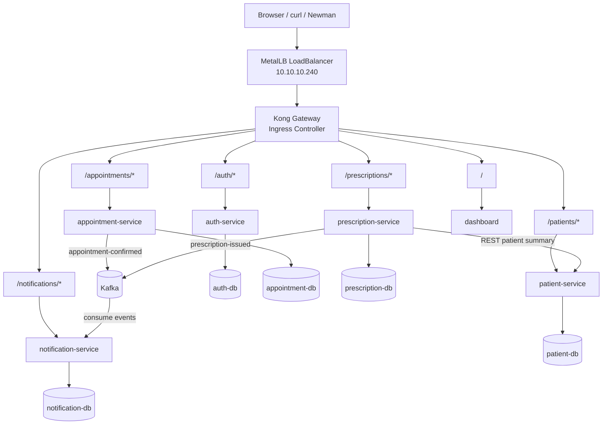
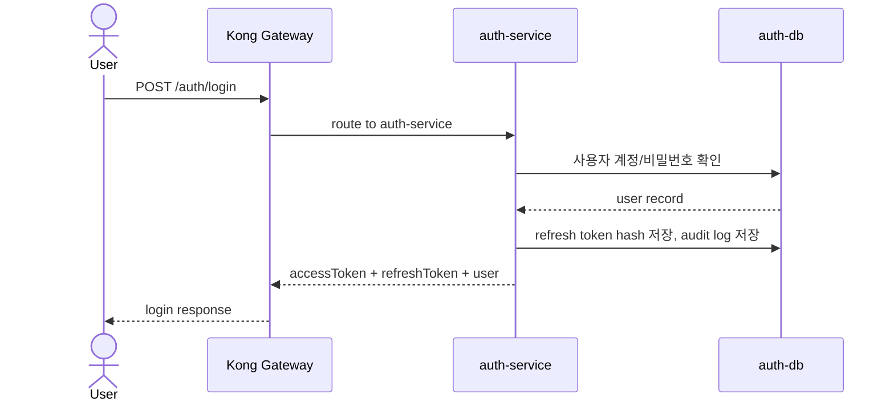
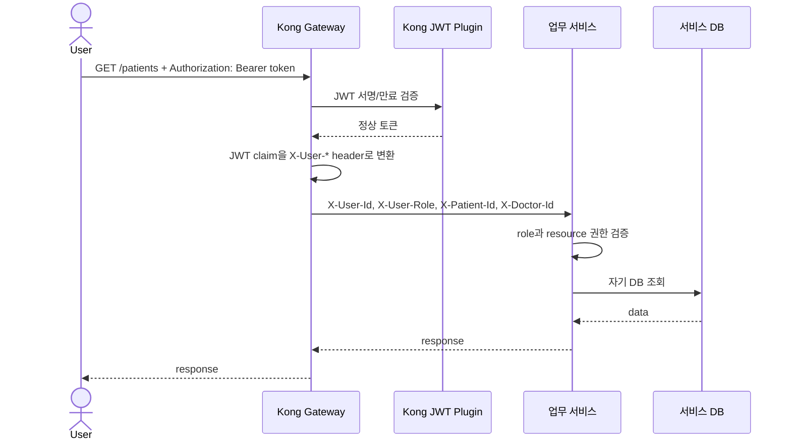
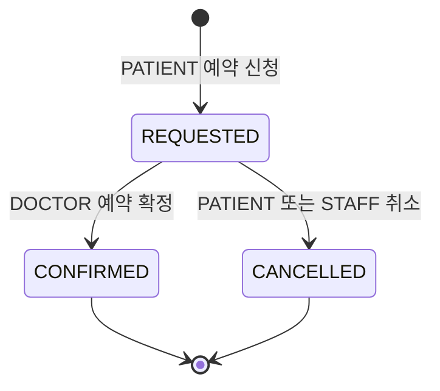
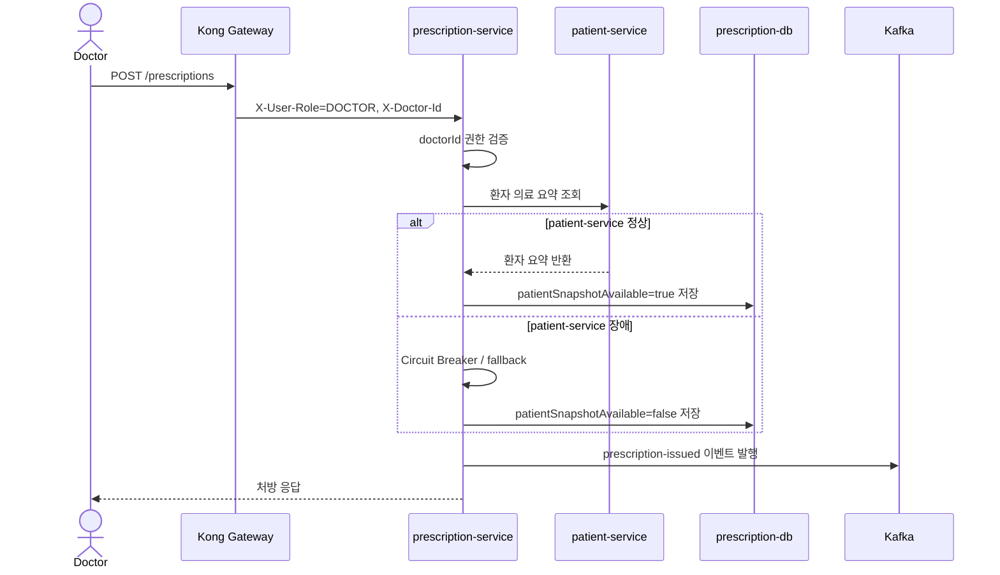
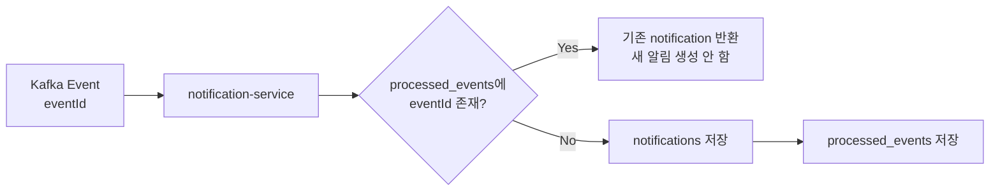
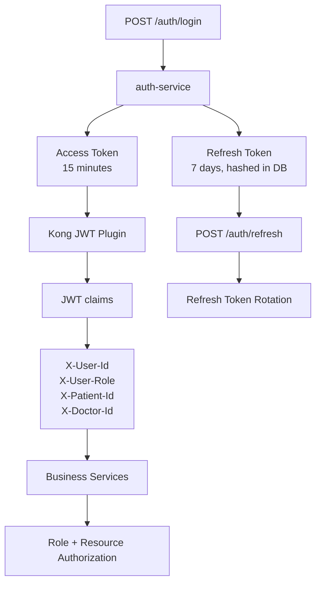
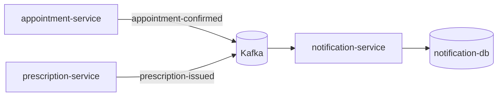
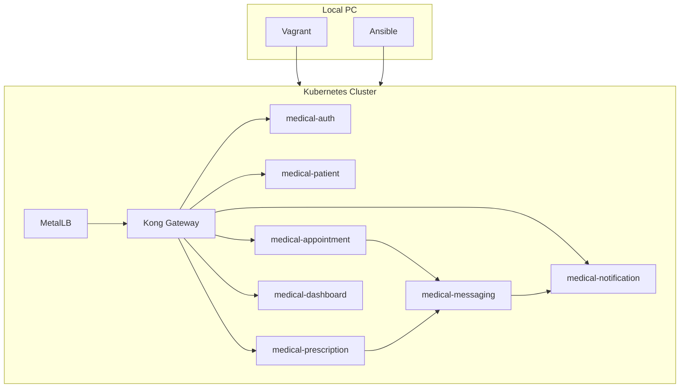

# MediKong 구현 발표 가이드

이 문서는 발표자가 프로젝트를 설명할 때 바로 사용할 수 있도록, 현재 구현한 내용과 설계 이유를 한 문서에 정리한 것이다.

핵심 메시지는 다음 한 문장으로 설명할 수 있다.

```text
MediKong은 병원 업무를 도메인별 마이크로서비스로 분리하고, 로컬 Kubernetes 환경에서 Kong Gateway, JWT 인증, Kafka 이벤트, 서비스별 DB, 장애 격리, NetworkPolicy를 검증하는 클라우드 네이티브 MSA 프로젝트다.
```

---

## 1. 프로젝트의 목적

이 프로젝트의 목적은 단순히 CRUD API를 만드는 것이 아니다.

목표는 다음과 같다.

1. 병원 업무 도메인을 여러 서비스로 나누어 MSA 구조를 구현한다.
2. 각 서비스가 자기 데이터베이스만 사용하도록 Database per Service 구조를 적용한다.
3. 서비스 간 통신은 상황에 따라 REST API와 Kafka 이벤트로 나눈다.
4. 외부 API 진입점은 Kong Gateway 하나로 통일한다.
5. JWT 인증은 Gateway에서 처리하고, 서비스는 인가와 리소스 권한 검증에 집중한다.
6. Kubernetes의 Service, DNS, Namespace, Deployment, StatefulSet으로 클라우드 네이티브 실행 구조를 만든다.
7. 장애가 한 서비스에서 전체 시스템으로 전파되지 않도록 Circuit Breaker와 fallback을 구현한다.
8. 포트폴리오용 구조 검증을 넘어서, 최소한의 서비스 안정성 보강도 포함한다.

즉, 이 프로젝트는 “의료 플랫폼”이라는 예제를 사용해서 MSA의 핵심 패턴을 실제 코드와 Kubernetes manifest로 구현한 프로젝트다.

---

## 2. 전체 아키텍처 한눈에 보기



이 구조에서 가장 중요한 점은 외부 사용자가 각 서비스에 직접 접근하지 않는다는 것이다.

모든 외부 요청은 `http://10.10.10.240`으로 들어오고, Kong Gateway가 path를 보고 내부 서비스로 라우팅한다.

---

## 3. 요청 흐름

### 3.1 로그인 흐름



`/auth/login`은 로그인 전 API이므로 Kong JWT plugin을 적용하지 않는다.

대신 로그인 성공 후 발급받은 access token을 업무 API 호출에 사용한다.

### 3.2 업무 API 호출 흐름



여기서 인증과 인가의 책임을 분리했다.

- 인증: Kong Gateway가 JWT를 검증한다.
- 인가: 각 서비스가 역할과 리소스 소유권을 검증한다.

이렇게 나눈 이유는 모든 서비스가 JWT 서명 검증 코드를 중복으로 갖지 않아도 되고, Gateway에서 공통 인증 정책을 관리할 수 있기 때문이다.

---

## 4. 서비스 분리 구조

현재 서비스는 다음 역할로 나뉜다.

| 서비스 | Namespace | 역할 | DB |
| --- | --- | --- | --- |
| `auth-service` | `medical-auth` | 로그인, JWT 발급, refresh/logout, audit log | `auth-db` |
| `patient-service` | `medical-patient` | 환자 정보, 알레르기, 복약 주의사항 관리 | `patient-db` |
| `appointment-service` | `medical-appointment` | 예약 신청, 예약 확정, 예약 취소 | `appointment-db` |
| `prescription-service` | `medical-prescription` | 처방 발행, 처방 조회, 환자 정보 fallback | `prescription-db` |
| `notification-service` | `medical-notification` | Kafka 이벤트 소비 후 알림 저장 | `notification-db` |
| `dashboard` | `medical-dashboard` | 사용자 화면 | 없음 |
| `kafka` | `medical-messaging` | 비동기 이벤트 브로커 | PV |
| Kong Gateway | `kong` | 외부 진입점, 라우팅, JWT, rate limit | 없음 |

서비스를 이렇게 나눈 이유는 병원 업무의 책임이 다르기 때문이다.

- 환자 정보는 환자 서비스가 책임진다.
- 예약 상태는 예약 서비스가 책임진다.
- 처방은 처방 서비스가 책임진다.
- 알림은 핵심 업무 이후에 비동기로 처리한다.
- 인증은 도메인 업무와 분리한다.

이렇게 분리하면 한 서비스의 코드 변경이 다른 서비스의 DB나 내부 로직을 직접 건드리지 않는다.

---

## 5. 서비스별 상세 구현

## 5.1 auth-service

### 구현한 것

`auth-service`는 사용자의 인증과 세션을 담당한다.

구현 기능:

- demo 계정 seed
- 로그인 API
- JWT access token 발급
- refresh token 발급
- refresh token hash 저장
- refresh token rotation
- logout 시 access token revoke
- logout 시 refresh token revoke
- `/auth/me` 내 정보 조회
- `/auth/audit-logs` 감사 로그 조회
- 로그인 성공/실패, 내 정보 조회, logout, audit log 조회 이벤트 기록

주요 API:

| API | 설명 |
| --- | --- |
| `POST /auth/login` | 이메일/비밀번호로 로그인 |
| `POST /auth/refresh` | refresh token으로 access token 재발급 |
| `GET /auth/me` | 현재 사용자 정보 조회 |
| `POST /auth/logout` | access token과 refresh token 폐기 |
| `GET /auth/audit-logs` | STAFF만 인증 이벤트 조회 |
| `GET /auth/demo-accounts` | 데모 화면 로그인 shortcut용 계정 정보 |

### 왜 이렇게 구현했는가

JWT는 stateless 인증이므로 Gateway가 빠르게 검증할 수 있다. 하지만 stateless 구조에는 단점이 있다.

토큰을 한 번 발급하면 서버가 DB에서 즉시 폐기 여부를 확인하지 않는 이상, 만료 전까지는 계속 유효하다.

그래서 이 프로젝트에서는 다음 절충안을 선택했다.

- access token은 15분으로 짧게 유지한다.
- refresh token으로 세션을 연장한다.
- logout 시 refresh token을 폐기해서 더 이상 세션이 연장되지 않게 한다.
- access token 즉시 폐기는 auth-service 내부 API에서는 적용하고, Kong 업무 API에서는 짧은 TTL로 위험 시간을 줄인다.

이 방식은 운영급 OIDC 전체 구현은 아니지만, 포트폴리오용 MVP에서 “세션 지속 제어”를 설명할 수 있는 최소 구조다.

### 발표할 때 설명할 포인트

```text
인증은 auth-service가 담당하지만, 업무 API의 JWT 검증은 Kong에서 수행합니다.
auth-service는 token 발급과 refresh/logout/audit log를 담당하고,
업무 서비스는 Kong이 전달한 사용자 context를 기반으로 인가만 수행합니다.
```

---

## 5.2 patient-service

### 구현한 것

`patient-service`는 환자 정보를 담당한다.

구현 기능:

- 환자 생성
- 환자 목록 조회
- 환자 단건 조회
- 환자 정보 수정
- 의료 요약 정보 수정
- 역할별 접근 제어

주요 API:

| API | 설명 |
| --- | --- |
| `POST /patients` | STAFF가 환자 등록 |
| `GET /patients` | STAFF 전체 조회, DOCTOR 담당 환자 조회 |
| `GET /patients/{id}` | STAFF, 담당 DOCTOR, 본인 PATIENT만 조회 |
| `PATCH /patients/{id}` | STAFF 전체 수정, 담당 DOCTOR는 의료 요약만 수정 |

### 권한 규칙

| 역할 | 허용 |
| --- | --- |
| `STAFF` | 환자 생성, 전체 조회, 전체 수정 |
| `DOCTOR` | 담당 환자 조회, 담당 환자 의료 요약 수정 |
| `PATIENT` | 본인 환자 정보 조회 |

### 왜 이렇게 구현했는가

환자 정보는 의료 시스템에서 가장 핵심적인 데이터다.

모든 서비스가 환자 DB를 직접 읽으면 다음 문제가 생긴다.

- 환자 DB 구조가 바뀔 때 모든 서비스가 영향을 받는다.
- 환자 정보 접근 권한을 일관되게 관리하기 어렵다.
- 서비스 간 결합도가 높아진다.

그래서 환자 정보는 `patient-service`만 직접 관리하고, 다른 서비스는 필요한 경우 API로 요청하도록 했다.

대표적으로 `prescription-service`는 처방 발행 시 환자 요약 정보가 필요하지만, 환자 DB를 직접 읽지 않고 `patient-service` API를 호출한다.

---

## 5.3 appointment-service

### 구현한 것

`appointment-service`는 진료 예약을 담당한다.

구현 기능:

- 예약 신청
- 예약 목록 조회
- 예약 단건 조회
- 예약 확정
- 예약 취소
- 예약 이벤트 이력 저장
- 예약 확정 시 Kafka 이벤트 발행

예약 상태:

| 상태 | 의미 |
| --- | --- |
| `REQUESTED` | 환자가 예약을 요청함 |
| `CONFIRMED` | 의사가 예약을 확정함 |
| `CANCELLED` | 예약이 취소됨 |

### 업무 흐름



### 왜 이렇게 구현했는가

예약은 상태 변화가 중요한 도메인이다.

단순히 현재 상태만 저장하면 “언제 예약이 요청됐고, 언제 확정됐는지”를 추적하기 어렵다.

그래서 현재 상태는 `appointments`에 저장하고, 상태 변화 이력은 `appointment_events`에 함께 저장했다.

주의할 점은 이것이 완전한 Event Sourcing은 아니라는 것이다.

현재 구현은:

```text
상태 테이블 + 이벤트 이력 저장
```

이고, 완전한 Event Sourcing처럼 이벤트만으로 상태를 재구성하는 구조는 아니다.

하지만 포트폴리오 관점에서는 예약 상태 변화와 이벤트 기반 알림 흐름을 설명하기에 충분한 구조다.

---

## 5.4 prescription-service

### 구현한 것

`prescription-service`는 처방 발행과 조회를 담당한다.

구현 기능:

- DOCTOR 처방 발행
- STAFF/DOCTOR/PATIENT 역할별 처방 조회
- 처방 발행 전 patient-service 호출
- patient-service 장애 시 fallback
- Circuit Breaker 적용
- 처방 발행 후 Kafka 이벤트 발행

### 처방 발행 흐름



### 왜 이렇게 구현했는가

처방 발행은 환자 정보와 관련이 있다.

예를 들어 처방 전에 환자의 알레르기나 복약 주의사항을 확인해야 한다.

하지만 처방 서비스가 환자 DB를 직접 읽으면 Database per Service 원칙이 깨진다.

그래서 처방 서비스는 `patient-service` API를 호출한다.

또한 환자 서비스가 잠시 장애라고 해서 처방 서비스 전체가 멈추면 장애가 전파된다.

그래서 다음 방식으로 장애 격리를 구현했다.

- patient-service 호출 실패를 감지한다.
- Circuit Breaker가 반복 실패 시 호출을 잠시 차단한다.
- 처방 자체는 저장한다.
- `patientSnapshotAvailable=false`와 warning을 남긴다.

이것은 “전체 실패 대신 가능한 부분 응답을 반환한다”는 MSA 장애 격리 패턴이다.

---

## 5.5 notification-service

### 구현한 것

`notification-service`는 알림 저장과 조회를 담당한다.

이 서비스는 사용자가 직접 알림을 생성하는 서비스가 아니다.

Kafka 이벤트를 소비해서 알림을 만든다.

소비하는 이벤트:

| Topic | 발생 서비스 | 의미 |
| --- | --- | --- |
| `appointment-confirmed` | appointment-service | 예약 확정 알림 |
| `prescription-issued` | prescription-service | 처방 발행 알림 |

구현 기능:

- Kafka consumer 실행
- 이벤트 payload 검증
- 알림 저장
- STAFF 전체 알림 조회
- PATIENT 본인 알림 조회
- `eventId` 기반 중복 처리 방지

### 중복 처리 방지 구조



### 왜 이렇게 구현했는가

Kafka consumer는 장애 복구나 재시작 상황에서 같은 이벤트를 다시 처리할 수 있다.

이때 같은 이벤트로 알림을 계속 만들면 환자에게 중복 알림이 생긴다.

그래서 `processed_events` 테이블을 두고 `eventId`를 unique하게 관리한다.

이 구조는 consumer idempotency를 위한 최소 구현이다.

Outbox pattern은 이번 범위에서 제외했지만, consumer 중복 방지는 실제 서비스 관점에서 꼭 필요한 보강이다.

---

## 5.6 dashboard

### 구현한 것

`dashboard`는 정적 HTML/JavaScript 기반 화면이다.

구현 기능:

- demo 계정 로그인 shortcut
- 로그인
- access token 저장
- refresh token 저장
- access token 만료 시 refresh 후 요청 재시도
- logout
- 역할별 화면 전환
- 환자/예약/처방/알림/audit log 조회 및 업무 액션

### 왜 이렇게 구현했는가

이 프로젝트의 핵심은 프론트엔드 프레임워크가 아니라 MSA와 Kubernetes 구조다.

그래서 React/Vue 같은 별도 빌드 시스템을 추가하지 않고, 정적 HTML로 사용자 시나리오를 확인할 수 있게 했다.

대신 실제 사용 흐름은 가능하도록 만들었다.

- STAFF는 환자 등록과 audit log 확인
- PATIENT는 예약 신청, 본인 처방/알림 조회
- DOCTOR는 예약 확정과 처방 발행

발표에서는 “프론트는 구조 검증을 위한 lightweight dashboard”라고 설명하면 된다.

---

## 6. Kong Gateway 구현

### 구현한 것

Kong Gateway는 외부 API의 단일 진입점이다.

구현 요소:

- Kong Ingress Controller
- LoadBalancer IP `10.10.10.240`
- path 기반 Ingress routing
- JWT plugin
- pre-function plugin으로 JWT claim을 `X-User-*` header로 변환
- rate limiting plugin
- correlation-id plugin
- prometheus plugin

### Ingress path

| Path | Service |
| --- | --- |
| `/auth` | auth-service |
| `/patients` | patient-service |
| `/appointments` | appointment-service |
| `/prescriptions` | prescription-service |
| `/notifications` | notification-service |
| `/` | dashboard |

### 왜 이렇게 구현했는가

MSA에서 클라이언트가 각 서비스를 직접 알면 구조가 복잡해진다.

서비스가 늘어날수록 클라이언트는 여러 host와 port를 알아야 하고, 인증/로깅/rate limit도 서비스마다 중복된다.

그래서 Gateway를 앞에 두었다.

Kong을 사용한 이유:

- Kubernetes Ingress와 잘 연동된다.
- JWT, rate limiting, correlation id 같은 기능을 plugin으로 적용할 수 있다.
- 서비스 코드를 수정하지 않고 공통 정책을 Gateway 계층에서 관리할 수 있다.

---

## 7. JWT 인증/인가 구조



### 구현한 보강

기존 access token only 구조에서 다음을 추가했다.

- access token TTL 15분
- refresh token 발급
- refresh token hash 저장
- refresh token rotation
- logout 시 refresh token 폐기
- dashboard refresh 자동 재시도

### 현재 한계

Kong JWT plugin은 stateless 방식이다.

그래서 auth-service의 `revoked_tokens` DB를 Kong이 직접 확인하지 않는다.

즉, logout 직후 이미 발급된 access token이 업무 API에서 즉시 막히는 구조는 아니다.

대신 access token TTL을 짧게 하고 refresh token을 폐기해서 세션 지속을 막는다.

발표에서는 이렇게 설명하면 좋다.

```text
운영급 즉시 토큰 폐기를 하려면 OIDC introspection이나 Kong custom plugin이 필요합니다.
이 프로젝트에서는 Gateway stateless 검증의 장점을 유지하면서,
짧은 access token과 refresh token 폐기로 MVP 수준의 세션 제어를 구현했습니다.
```

---

## 8. Kafka 이벤트 구조



### 구현한 것

- Kafka StatefulSet
- topic 생성 Job
- `appointment-confirmed` topic
- `prescription-issued` topic
- appointment-service producer
- prescription-service producer
- notification-service consumer
- `eventId` 기반 중복 처리 방지

### 왜 Kafka를 사용했는가

알림은 예약 확정이나 처방 발행의 핵심 트랜잭션에 포함되지 않아도 된다.

예를 들어 예약 확정은 즉시 완료되어야 하지만, 알림 저장은 약간 늦어져도 된다.

그래서 알림은 비동기 이벤트로 분리했다.

이렇게 하면 다음 장점이 있다.

- 예약 서비스가 알림 서비스의 응답을 기다리지 않는다.
- 알림 서비스 장애가 예약 확정 API 전체 장애로 바로 전파되지 않는다.
- 나중에 문자, 푸시, 이메일 같은 다른 consumer를 추가하기 쉽다.

### 현재 한계

Outbox pattern은 아직 제외했다.

따라서 DB 저장은 성공했는데 Kafka publish가 실패하는 경우 이벤트 유실 가능성이 남아 있다.

이 부분은 후속 개선으로 설명하면 된다.

```text
현재는 이벤트 기반 흐름과 consumer idempotency까지 구현했고,
producer 측 이벤트 유실 방지는 Outbox pattern을 후속 과제로 남겼습니다.
```

---

## 9. Kubernetes 구현 구조



### 구현한 것

- Vagrant VM 기반 로컬 Kubernetes 환경
- Ansible로 서버 구성 자동화
- kubeadm 기반 클러스터 구성
- local registry `10.10.10.10:5000`
- MetalLB LoadBalancer
- Kong Gateway
- namespace 분리
- Deployment 기반 FastAPI 서비스
- StatefulSet 기반 PostgreSQL DB
- StatefulSet 기반 Kafka
- PersistentVolume / PVC
- Kustomize overlay

### 왜 이렇게 구현했는가

Docker Compose만 사용하면 컨테이너 실행은 확인할 수 있지만 Kubernetes의 핵심 요소를 설명하기 어렵다.

이 프로젝트의 요구사항은 클라우드 네이티브 MSA 구조 검증이기 때문에 Kubernetes 기반으로 구성했다.

Kubernetes를 사용하면 다음을 보여줄 수 있다.

- 서비스별 독립 Deployment
- Service DNS 기반 discovery
- ClusterIP 내부 통신
- Ingress Gateway
- Namespace 격리
- Stateful workload
- PV/PVC 기반 저장소
- 실제 배포 manifest

---

## 10. NetworkPolicy 구현

### 구현한 것

NetworkPolicy를 추가해서 내부 신뢰 경계를 강화했다.

허용한 대표 흐름:

| 대상 | 허용 출발지 |
| --- | --- |
| 업무 서비스 | Kong namespace |
| patient-service | Kong, prescription-service |
| 각 DB | 자기 서비스 Pod |
| Kafka | topic Job, appointment-service, prescription-service, notification-service |
| dashboard | Kong namespace |

### 왜 이렇게 구현했는가

업무 서비스는 `X-User-*` header를 신뢰한다.

이 header는 Kong이 JWT를 검증한 뒤 생성해야 한다.

그런데 클러스터 내부 아무 Pod에서나 업무 서비스를 직접 호출할 수 있으면, 공격자가 header를 위조할 수 있다.

그래서 NetworkPolicy로 “업무 서비스는 Kong 또는 필요한 내부 서비스에서만 접근 가능하다”는 경계를 추가했다.

주의:

NetworkPolicy는 CNI가 정책 enforcement를 지원해야 실제로 적용된다.

---

## 11. Observability 구현

### 구현한 것

- Kong correlation-id plugin
- `X-Request-Id` 생성
- FastAPI request logging middleware
- 서비스별 요청 method/path/status/duration 로그
- prescription-service가 patient-service 호출 시 request id 전달
- Kong prometheus plugin 활성화

### 왜 이렇게 구현했는가

MSA에서는 요청 하나가 여러 서비스를 거칠 수 있다.

문제가 생겼을 때 “어떤 요청이 어느 서비스에서 실패했는지” 추적할 수 있어야 한다.

그래서 Gateway에서 request id를 만들고, 각 서비스 로그에 같은 request id를 남기게 했다.

Prometheus/Grafana 전체 수집 스택은 아직 후속 과제지만, Kong이 metric을 노출할 준비는 되어 있다.

---

## 12. 테스트와 검증

### 단위/서비스 테스트

pytest로 각 서비스의 핵심 로직을 검증한다.

검증 범위:

- auth-service: login, refresh, logout, audit log
- patient-service: 역할별 환자 접근 권한
- appointment-service: 예약 생성/확정/취소 권한
- prescription-service: 처방 발행, fallback
- notification-service: 알림 생성, 중복 이벤트 방지, 역할별 조회

최근 확인 결과:

```text
auth-service:          2 passed
patient-service:      10 passed
appointment-service:   6 passed
prescription-service:  5 passed
notification-service:  6 passed
```

### E2E 테스트

Newman/Postman Collection으로 Kong Gateway를 실제로 통과하는 사용자 시나리오를 검증한다.

검증 흐름:

1. STAFF가 환자 생성
2. PATIENT가 예약 신청
3. DOCTOR가 예약 확정
4. 예약 확정 이벤트가 Kafka로 발행
5. notification-service가 알림 생성
6. DOCTOR가 처방 발행
7. 처방 발행 이벤트가 Kafka로 발행
8. PATIENT가 본인 알림과 처방 조회

---

## 13. 구현한 구조와 이유 요약

| 구조 | 구현 | 이유 |
| --- | --- | --- |
| MSA 분리 | auth, patient, appointment, prescription, notification | 도메인 책임 분리 |
| Database per Service | 서비스별 PostgreSQL | DB 결합도 제거 |
| REST 통신 | prescription -> patient | 처방 발행 시 즉시 환자 정보 확인 필요 |
| Kafka 이벤트 | appointment/prescription -> notification | 알림은 비동기로 처리해 장애 전파 감소 |
| Kong Gateway | 단일 진입점, routing, JWT, rate limit | 공통 정책을 서비스 밖에서 관리 |
| JWT 인증 | Kong plugin + auth-service token 발급 | 인증 공통화, 서비스는 인가 집중 |
| Refresh token | DB hash 저장, rotation | 세션 지속 제어 |
| NetworkPolicy | Kong/내부 호출만 허용 | header 위조와 직접 호출 위험 감소 |
| Circuit Breaker | prescription의 patient-service 호출 보호 | 의존 서비스 장애 전파 방지 |
| Consumer idempotency | processed_events | Kafka 중복 이벤트 처리 방지 |
| Observability | X-Request-Id, request logging | 분산 요청 추적 |
| Kustomize overlay | local 배포 구성 | 환경별 manifest 관리 |

---

## 14. 발표 흐름 추천

발표는 다음 순서로 하면 이해가 쉽다.

1. 이 프로젝트는 병원 업무를 예제로 한 MSA 구조 검증 프로젝트라고 소개한다.
2. 전체 구조도를 보여주고, 모든 요청이 Kong으로 들어간다고 설명한다.
3. 서비스를 auth, patient, appointment, prescription, notification으로 나눈 이유를 설명한다.
4. Database per Service 원칙을 설명한다.
5. REST와 Kafka를 왜 나누어 썼는지 설명한다.
6. JWT 인증은 Kong, 인가는 서비스가 맡는다고 설명한다.
7. 최근 보강한 refresh token, NetworkPolicy, Kafka 중복 방지를 설명한다.
8. prescription-service의 Circuit Breaker/fallback으로 장애 격리를 설명한다.
9. Kubernetes 배포 구조와 namespace, ClusterIP, DNS를 설명한다.
10. 테스트 결과와 E2E 검증 흐름을 설명한다.
11. 마지막으로 한계와 후속 개선을 솔직하게 말한다.

---

## 15. 한계와 후속 개선

현재 프로젝트는 포트폴리오/구조 검증용 MVP로는 충분하지만, 운영급 서비스는 아니다.

남아 있는 한계:

- Outbox pattern 없음
- Kafka DLQ 없음
- Kafka broker 단일 구성
- Schema Registry 없음
- Prometheus/Grafana 전체 수집 스택 미구성
- JWT access token 즉시 중앙 폐기 미구현
- 운영 Secret Manager 미사용
- HPA/PodDisruptionBudget 미구현
- Alembic 같은 DB migration 도구 미적용

후속 개선 방향:

1. Outbox pattern으로 DB 저장과 이벤트 발행 정합성 보강
2. DLQ와 retry 정책 추가
3. Keycloak/Cognito/OIDC 기반 인증으로 전환
4. Prometheus/Grafana/Alertmanager 구성
5. EKS, RDS, MSK, ECR, Route 53, ACM으로 AWS 운영 환경 확장

발표에서는 이 한계를 숨기기보다 다음처럼 설명하면 좋다.

```text
현재 구현은 운영 전체를 완성한 것이 아니라,
MSA의 핵심 구조와 클라우드 네이티브 배포 패턴을 로컬 Kubernetes에서 검증하는 MVP입니다.
다만 인증 세션, 내부 접근 경계, Kafka 중복 처리처럼 서비스 관점에서 중요한 최소 보강은 포함했습니다.
```
